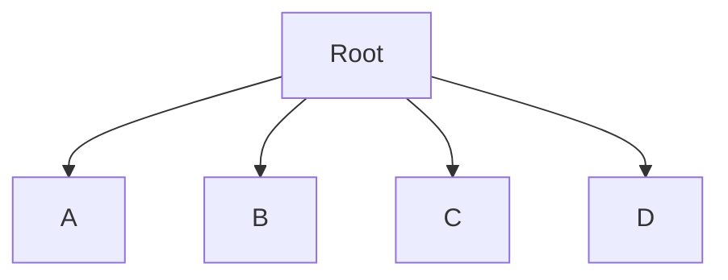
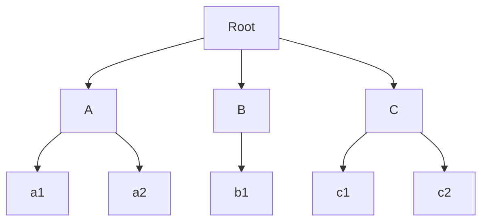
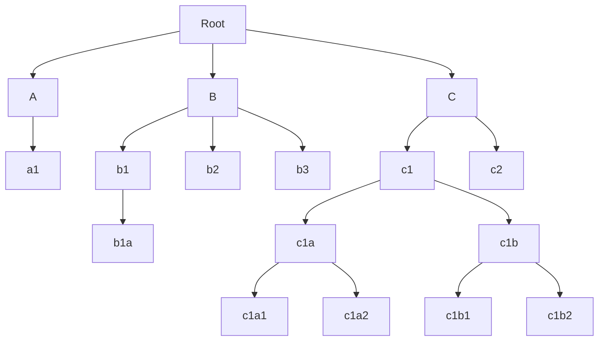

## Acesso aos arquivos

O sistema operacional fornece diferentes métodos para acessar os dados armazenados em um arquivo, cada um adequado para diferentes tipos de aplicações:

1. **Acesso Sequencial**:
    - **Funcionamento**: Neste método, os dados são lidos ou escritos em uma ordem predefinida, do início ao fim do arquivo. É como ler um livro página por página, sem pular. Cada operação de leitura avança um ponteiro de posição atual no arquivo para o próximo item (byte, caractere ou registro), e a próxima operação de leitura começará a partir dessa nova posição.
    - **Aplicação**: É o método de acesso mais simples e é frequentemente usado para arquivos de texto, áudio, vídeo ou logs, onde o processamento ocorre de forma linear.
2. **Acesso Direto (ou Acesso Aleatório)**:
    - **Funcionamento**: Diferente do acesso sequencial, o acesso direto permite que os dados sejam lidos ou escritos em qualquer ordem, pulando para qualquer posição arbitrária dentro do arquivo. Isso é análogo a abrir um livro em qualquer página desejada. Para realizar o acesso direto, o sistema operacional precisa de um mecanismo para especificar o "endereço" ou "offset" (deslocamento) dentro do arquivo onde a operação deve começar.
    - **Aplicação**: Este método é essencial para aplicações que necessitam de acesso rápido a partes específicas de um arquivo grande, como sistemas de gerenciamento de banco de dados, índices e arquivos que contêm registros de tamanho fixo onde cada registro pode ser acessado diretamente por seu número ou offset.

### Leitura e Escrita de Arquivos

A leitura e a escrita são as operações fundamentais para manipular o conteúdo de um arquivo. Elas são realizadas por meio de chamadas de sistema, que são interfaces entre o programa de usuário e o kernel do sistema operacional.

#### Processo Geral de Leitura:

1.  **Abertura do arquivo:**
	- Antes de ler, o programa deve "abrir" o arquivo usando uma chamada de sistema `open()`. Esta chamada retorna um **descritor de arquivo** (um pequeno inteiro, como um índice em uma tabela de arquivos abertos mantida pelo kernel) que será usado em todas as operações subsequentes. A chamada `open()` também especifica o mode de acesso (leitura, escrita, ambos).
2. **Chamada de sistema `read()`:**
	- Para ler dados, o programa invoca a chamada de sistema `read()`, passando o descritor de arquivo, um buffer na memória do processo onde os dados lidos serão armazenados, e o número de bytes a serem lidos. 
3. **Operação do kernel:**
	- O kernel usa o descritor de arquivo para localizar o arquivo na tabela de arquivos abertos do processo e, em seguida, na tabela global de arquivos abertos do sistema.
	- Ele determina a posição atual do ponteiro de arquivo dentro do arquivo
	- Se os dados não estiverem no cache de disco em memória, o kernel os busca do dispositivo de armazenamento físico (disco, SSD) para o buffer no cache.
	- Os dados são então copiados do buffer do cache para o buffer fornecido pelo programa de usuário.
	- O ponteiro de arquivo é avançado pelo número de bytes lidos.
4. **Retorno:**
	- A chamada `read()` retorna o número real de bytes lidos (que poder ser menor que o solicitado, por exemplo, ao atingir o final do arquivo) ou um erro.

#### Processo Geral de Escrita:

1. **Abertura do arquivo:**
	- Simular à leitura, o arquivo é aberto em modo de escrita (ou escrita/leitura)
2. **Chamada de sistema `write()`:**
	- O programa invoca a chama de sistema `write()`, passando o descritor de arquivo, um buffer na memória do processo contendo os dados a serem escritos, e o número de bytes a serem escritos.
3. **Operação do kernel:**
	- O kernel recebe os dados do buffer do processo de usuário.
	- Esses dados são copiados para um buffer de cache no espaço do kernel.
	- O kernel então agenda a gravação desses dados do cache para o dispositivo de armazenamento físico. A gravação real pode não ocorrer imediatamente (escrita em cache), mas o kernel garante que os dados serão persistidos em algum momento, a menos que o sistema falhe antes de sincronizar o cache. Para garantir a persistência imediata, chamadas como `fsync()`podem ser usadas.
	- O ponteiro de arquivo é avançado pelo número de bytes escritos.
4. **Retorno:**
	- A chamada `write()` retorna o número real de bytes escritos ou um erro.

#### Métodos para especificar onde iniciar a leitura:

Para implementar o acesso direto (aleatório), o sistema operacional fornece mecanismos para controlar a posição atual do ponteiro de arquivo dentro do arquivo. O principal método para isso é a chamada de sistema `seek` (ou `lseek` em sistemas Unix-like).
##### A Chamada `seek()`:
- **Finalidade**: A função `seek()` (ou `lseek()`) permite que um programa altere explicitamente a posição do ponteiro de arquivo para um deslocamento arbitrário dentro do arquivo. Isso é crucial para implementar acesso direto, pois permite que o programa pule para qualquer byte ou registro sem ler o que vem antes.
- **Parâmetros Típicos**:
    - **Descritor de Arquivo**: O identificador do arquivo aberto que será manipulado.
    - **Deslocamento (offset)**: Um valor numérico que indica quantos bytes o ponteiro de arquivo deve ser movido.
    - **Origem (whence/start position)**: Define a partir de qual ponto o deslocamento será calculado. Geralmente, há três opções:
        - **Início do Arquivo (SEEK_SET/0)**: O deslocamento é contado a partir do byte zero do arquivo. Se `offset` for 100, o ponteiro irá para o byte 100.
        - **Posição Atual (SEEK_CUR/1)**: O deslocamento é relativo à posição atual do ponteiro de arquivo. Se o ponteiro estiver no byte 50 e `offset` for 10, o ponteiro irá para o byte 60. Se `offset` for -10, irá para o byte 40.
        - **Fim do Arquivo (SEEK_END/2)**: O deslocamento é relativo ao fim do arquivo. Um `offset` de 0 com `SEEK_END` posiciona o ponteiro no final do arquivo (útil para adicionar dados ao final). Um `offset` negativo com `SEEK_END` posiciona o ponteiro a partir do final (por exemplo, -10 bytes do fim).
- **Retorno**: A chamada `seek()` geralmente retorna a nova posição absoluta do ponteiro de arquivo a partir do início do arquivo.
- **Impacto nas Operações Futuras**: Após uma chamada `seek()`, as próximas operações de `read()` ou `write()` começarão a partir da nova posição do ponteiro de arquivo. O ponteiro de arquivo será subsequentemente avançado à medida que as operações de leitura/escrita progridem.

### Operações de arquivos (system calls)

| Operação            | Descrição                                                                 |
|---------------------|---------------------------------------------------------------------------|
| 📂 Abrir (Open)     | Abre o arquivo para leitura, escrita ou ambos. Retorna um ponteiro ou identificador. |
| 📝 Ler (Read)       | Lê dados do arquivo para a memória. Pode ser feito por bytes, linhas ou blocos.        |
| ✏️ Escrever (Write) | Grava dados da memória no arquivo. Pode substituir ou adicionar conteúdo.              |
| 📍 Posicionar (Seek)| Move o ponteiro de leitura/escrita para uma posição específica no arquivo.            |
| 📏 Obter posição     | Retorna a posição atual do ponteiro de leitura/escrita no arquivo.                    |
| 🔁 Rewind           | Move o ponteiro para o início do arquivo.                                              |
| ❌ Fechar (Close)   | Encerra o uso do arquivo, liberando recursos do sistema.                              |
| 🗑️ Remover (Delete) | Exclui o arquivo do sistema de arquivos.                                               |
| 🔐 Alterar permissões | Modifica quem pode ler, escrever ou executar o arquivo.                              |
| 🧾 Renomear         | Altera o nome do arquivo no sistema.                                                  |
### Arquivos Mapeados na Memória

Arquivos mapeados na memória (ou *memory-mapped files*) são uma técnica avançada de gerenciamento de memória e E/S que permite a um programa acessar o conteúdo de um arquivo em disco como se ele fosse um porção da memória virtual do processo.

Em vez de usar as operações tradicionais de `read()` e `write()` para mover dados entre o disco e a memória, o S.O "projeta" o arquivo diretamente no espaço de endereçamento virtual do processo.
#### **Como Funciona:**

- **Mapeamento**: O processo faz uma chamada de sistema (como `mmap()` em sistemas POSIX/Unix ou `CreateFileMapping()` e `MapViewOfFile()` no Windows) para mapear uma parte ou a totalidade de um arquivo para seu espaço de endereçamento virtual.
- **Gerenciamento de Página**: O sistema operacional, por meio de seu subsistema de memória virtual, gerencia o mapeamento. Inicialmente, as páginas do arquivo podem não ser carregadas para a memória RAM.
- **Acesso sob Demanda**: Quando o programa tenta acessar um endereço virtual que corresponde a uma parte do arquivo mapeado que ainda não está na memória física (RAM), ocorre um _page fault_.
- **Carregamento de Página**: O manipulador de _page fault_ do sistema operacional detecta que a página pertence a um arquivo mapeado, localiza a página correspondente no disco, a carrega para um _frame_ de página livre na memória física e atualiza as tabelas de páginas do processo. O processo pode então continuar sua execução como se a página sempre estivesse na memória.
- **Escrita Automática (Page Out)**: Se o programa modificar uma página mapeada do arquivo, o sistema operacional a marca como "suja" (dirty). Em algum momento posterior, o sistema operacional irá escrever essa página de volta para o disco, sincronizando as alterações. Isso pode acontecer quando a página é selecionada para substituição (page out) ou quando o arquivo é explicitamente sincronizado (e.g., com `msync()` ou `FlushViewOfFile()`) ou fechado.

### Diretórios

No contexto de sistema de arquivos, os **diretórios** (ou pastas) são estruturas de dados especiais mantidas pelo sistema operacional para organizar e gerenciar os arquivos. Servindo como catálogo, mapeando os nomes dos arquivos e suas localizações reais em disco.

#### Diretórios são arquivos? 

Sim, diretórios são tratados como um tipo especial de arquivo em diversos sistemas operacionais, como os baseados em UNIX.
#### Como é o conteúdo desses "arquivos diretório"?

O conteúdo de um "arquivo diretório" não são dados arbitrários, mas sim uma lista de entradas, onde cada entrada tipicamente contém:

- O nome de um arquivo ou subdiretório dentro dele.
- Um ponteiro para os metadados desses arquivo/subdiretório
#### Diretórios podem ser organizados da seguinte maneira:

##### Nível Único:

##### Dois Níveis:

##### Hierárquica:

#### Caminhos:

Existem 2 tipos de caminhos, para se acessar um arquivos de um diretório.

- Caminho absoluto:
	- Único.
	- É a composição total do caminho, unindo todos os nós, do root até o arquivo/diretório.
	- Ex..: /usr/bin/process
- Caminho relativo:
	- Considera o diretório atual.
	- Utiliza como base para a composição o diretório atual para compor o endereço de seus arquivos/subdiretórios.
	- Ex..: /bin/process
		- Assume que estamos no diretório /usr/

#### Links:

Permite um arquivo aparecer em mais de um diretório. São esses os chamados atalhos (windows) ou links (Unix/Linux) 
##### Hard Link:
- Incrementa o contador de links no i-node
- Nenhum arquivo realmente é apagado enquanto seu contador não for 0, significa que o arquivo correspondente só estava nesse diretório, então remove-o do sistema de arquivos.
###### Unlink:
- Remove uma entrada (arquivo) no diretório.
- Decrementando o contador de links do arquivo (i-node).
- Se após a remoção o contador ficar como 0
##### Soft Link:
- Ponteiro para um arquivo em outro diretório.
- Não incrementa contador nenhum.
